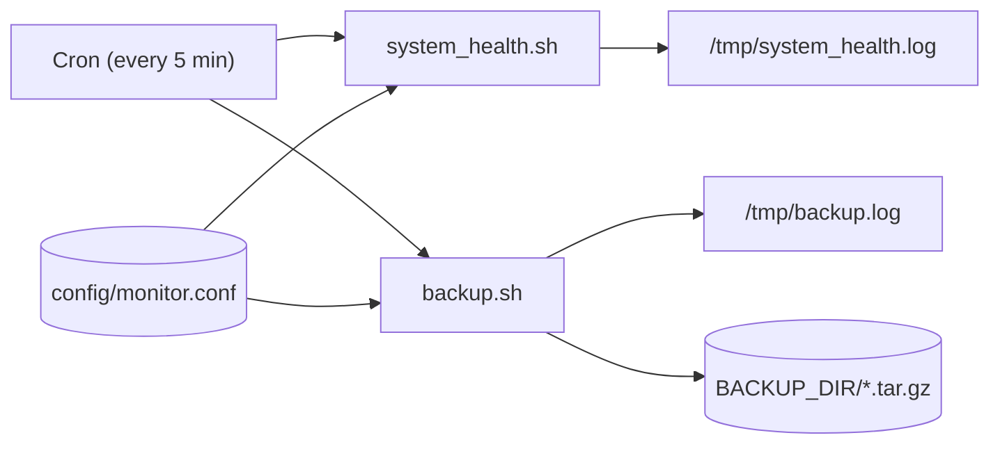
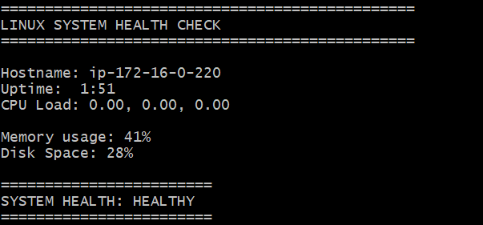
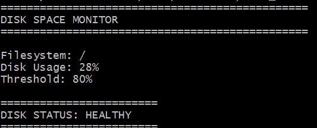
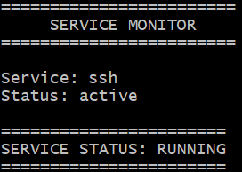
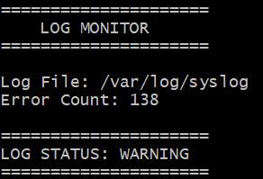
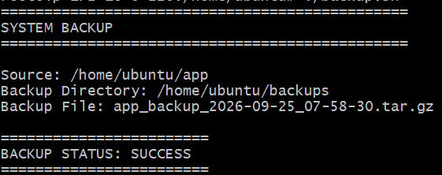

# 🖥️ Linux Server Health Monitoring & Automation Toolkit

> Bash scripts that check server health, disk space, services, and logs, and automate backups — scheduled with Cron and driven by one shared configuration file.

   

**At a glance**
- 🧩 5 independent, single-purpose Bash scripts: system health, disk space, service status, log errors, and backups
- ⚙️ One shared config file (`config/monitor.conf`) instead of hard-coded thresholds and paths
- ⏱️ Cron-scheduled execution every 5 minutes, with output captured to log files
- ✅ Manually tested end-to-end, including a documented bug fix (see [Troubleshooting](#-troubleshooting--lessons-learned))
- 🐧 Built and verified on Ubuntu Linux

---

## 📚 Table of Contents

- [Project Overview](#-project-overview)
- [Objectives](#-objectives)
- [Technology Stack](#technology-stack)
- [Project Structure](#-project-structure)
- [Prerequisites](#-prerequisites)
- [Getting Started](#-getting-started)
- [Configuration](#configuration)
- [Scripts](#-scripts)
  - [System Health Monitoring](#-system-health-monitoring)
  - [Disk Space Monitoring](#-disk-space-monitoring)
  - [Service Monitoring](#-service-monitoring)
  - [Log Monitoring](#-log-monitoring)
  - [Automated Backup](#automated-backup)
- [Exit Codes Reference](#-exit-codes-reference)
- [Automation with Cron](#-automation-with-cron)
- [Logging](#-logging)
- [Testing & Validation](#-testing--validation)
- [Troubleshooting & Lessons Learned](#-troubleshooting--lessons-learned)
- [Screenshots](#-screenshots)
- [Key DevOps Concepts Demonstrated](#-key-devops-concepts-demonstrated)
- [Interview Preparation](#-interview-preparation)
- [Known Limitations](#-known-limitations)
- [Future Improvements](#-future-improvements)
- [Project Status](#-project-status)
- [Author](#author)
- [License](#-license)

---

## 📌 Project Overview

The **Linux Server Health Monitoring & Automation Toolkit** is a small collection of Bash scripts that together cover the core responsibilities of day-one Linux server operations. Instead of one large script, each responsibility is its own file, and all of them can be run by hand or wired into Cron.

This toolkit automates:

- System health monitoring
- Disk space monitoring
- Service monitoring
- Log monitoring
- Backup creation
- Cron-based scheduled execution
- Centralized configuration management
- Operational logging

All scripts were written, tested, and documented on **Ubuntu Linux**.

## 🎯 Objectives

- Automate repetitive Linux administration tasks.
- Monitor important server health metrics.
- Detect disk and system resource issues.
- Verify Linux service availability.
- Identify errors in system logs.
- Create compressed backups.
- Schedule automated monitoring using Cron.
- Maintain reusable configuration instead of hard-coding values.
- Capture execution evidence through logs and screenshots.

## Technology Stack

| Technology | Purpose |
|---|---|
| Linux / Ubuntu | Server operating system |
| Bash | Automation and scripting |
| `systemctl` | Linux service management |
| `awk` | Output processing and data extraction |
| `df` | Disk space monitoring |
| `free` | Memory monitoring |
| `uptime` | System uptime and load monitoring |
| `grep` | Log pattern matching (error detection) |
| `tar` | Backup compression |
| `date` | Timestamp generation for backup filenames |
| Cron | Task scheduling |
| `/var/log/syslog` | System log monitoring |
| GitHub | Source code and documentation |

## 📁 Project Structure

```text
01-linux-shell-scripting/
├── README.md
├── scripts/
│   ├── system_health.sh
│   ├── disk_monitor.sh
│   ├── service_monitor.sh
│   ├── log_monitor.sh
│   └── backup.sh
├── config/
│   ├── monitor.conf
│   └── cronjobs.conf
├── logs/
│   ├── README.md
│   ├── system_health.log
│   └── backup.log
└── screenshots/
    ├── System-Health-Test.png
    ├── Disk-Space-Moniter.png
    ├── Service_Monitor.png
    ├── Log_Monitor.png
    └── System-Backup.png
```

## ✅ Prerequisites

- A Linux server or VM — developed and tested on Ubuntu; should work on most Debian-based distributions with Bash 4+
- Bash (`/bin/bash`)
- Standard core utilities already present on virtually every Linux system: `awk`, `df`, `free`, `uptime`, `grep`, `tar`, `date`
- `systemd` (`systemctl`) and at least one service to check — e.g. `ssh`, `nginx`, `cron` — for `service_monitor.sh`
- Read access to `/var/log/syslog` (typically available to `root` or members of the `adm` group on Ubuntu) for `log_monitor.sh`
- `cron`/`crond` installed and running, for scheduled execution

## 🚀 Getting Started

```bash
# 1. Clone the repository
git clone https://github.com/dileepkumar-bit/devops-portfolio.git
cd devops-portfolio/01-linux-shell-scripting

# 2. Make the scripts executable
chmod +x scripts/*.sh

# 3. Review and adjust the shared configuration
nano config/monitor.conf

# 4. Run any script directly from the project root
./scripts/system_health.sh
./scripts/disk_monitor.sh
./scripts/service_monitor.sh ssh
./scripts/log_monitor.sh
./scripts/backup.sh
```

Each script prints a banner, its findings, and a final status line, then exits (see [Exit Codes Reference](#-exit-codes-reference)).

## Configuration

Shared values live in `config/monitor.conf` instead of being duplicated across scripts:

```bash
MEMORY_THRESHOLD=80
DISK_THRESHOLD=80
SOURCE_DIR="/home/ubuntu/app"
BACKUP_DIR="/home/ubuntu/backups"
```

| Variable | Used by | Description | Default |
|---|---|---|---|
| `MEMORY_THRESHOLD` | `system_health.sh` | Memory usage % at or above which the server is UNHEALTHY | `80` |
| `DISK_THRESHOLD` | `system_health.sh`, `disk_monitor.sh` | Disk usage % at or above which status becomes WARNING/UNHEALTHY | `80` |
| `SOURCE_DIR` | `backup.sh` | Directory that gets archived | `/home/ubuntu/app` |
| `BACKUP_DIR` | `backup.sh` | Directory where `.tar.gz` archives are written | `/home/ubuntu/backups` |

> `service_monitor.sh` doesn't read this file — the service name comes from its command-line argument. `log_monitor.sh` also doesn't read it — its log path and search pattern are currently hard-coded (see [Known Limitations](#-known-limitations)).

Cron's schedule is documented separately in `config/cronjobs.conf` (see [Automation with Cron](#-automation-with-cron)).

## 🔧 Scripts

Every script is self-contained, prints a clear banner and result, and returns via `exit` (see [Exit Codes Reference](#-exit-codes-reference)). Full source for each is included below in a collapsed section.

### 🩺 System Health Monitoring

**File:** `scripts/system_health.sh`

Prints one consolidated snapshot of server health and classifies it as HEALTHY or UNHEALTHY against the thresholds in `monitor.conf`.

**Checks:** hostname · uptime · CPU load averages (1/5/15 min) · memory usage % (`free`) · root filesystem usage % (`df`)

**Usage**
```bash
./scripts/system_health.sh
```

**Example output**
```text
===================================
      LINUX SYSTEM HEALTH CHECK
===================================

Hostname: ip-172-16-0-220
Uptime:  10 min
CPU load: 0.03, 0.02, 0.00

Memory Usage: 39%
Disk Space: 29%

========================
SYSTEM HEALTH: HEALTHY
========================
```

If memory **or** disk usage reaches its threshold, the final block instead reads:
```text
=========================
SYSTEM HEALTH: UNHEALTHY
=========================
```

**Exit status:** always `0`, regardless of the reported status — see [Known Limitations](#-known-limitations).

<details>
<summary>View full source — <code>scripts/system_health.sh</code></summary>

```bash
#!/bin/bash

##############################
##############################
# Author: Dileep
# Script: System_Health
##############################
##############################

echo "==================================="
echo "      LINUX SYSTEM HEALTH CHECK"
echo "==================================="

# Central configuration file
source "$(dirname "$0")/../config/monitor.conf"

# Hostname
echo 
HOST=$(hostname)
echo "Hostname: $HOST"

# Uptime
TIME=$(uptime | awk -F'up |,' '{print $2}')
LOAD=$(uptime | awk -F'load average: ' '{print $2}')
echo "Uptime: $TIME"
echo "CPU load: $LOAD"
echo

# Memory usage
MEMORY=$(free -h | awk '/Mem:/ {printf "%.0f", $3/$2*100}')
echo "Memory Usage: $MEMORY%"

# Disk space
DISK=$(df -h / | awk 'NR==2 {gsub("%","",$5); print $5}')
echo "Disk Space: $DISK%"
echo 

# Check system health
if [ "$MEMORY" -lt "$MEMORY_THRESHOLD" ] && [ "$DISK" -lt "$DISK_THRESHOLD" ]; then
    echo "========================"
    echo "SYSTEM HEALTH: HEALTHY"
    echo "========================"
else
    echo "========================="
    echo "SYSTEM HEALTH: UNHEALTHY"
    echo "========================="
fi
```

</details>

---

### 💽 Disk Space Monitoring

**File:** `scripts/disk_monitor.sh`

Focuses solely on root filesystem usage and compares it against `DISK_THRESHOLD`.

**Checks:** root filesystem (`/`) · current disk usage % · configured threshold

**Usage**
```bash
./scripts/disk_monitor.sh
```

**Example output**
```text
========================
   DISK SPACE MONITOR
========================

Filesystem: /
Disk Usage: 29%
Threshold: 80%

========================
DISK STATUS: HEALTHY
========================
```

When usage reaches or exceeds the threshold:
```text
=========================
DISK STATUS: WARNING
=========================
```

**Exit status:** `0` when healthy, `1` when at or above the threshold.

<details>
<summary>View full source — <code>scripts/disk_monitor.sh</code></summary>

```bash
#!/bin/bash
##############################
##############################
# Author: Dileep
# Script: Disk Space Monitor
##############################
##############################
echo "========================"
echo "   DISK SPACE MONITOR"
echo "========================"
echo 

#central configuration file
source "$(dirname "$0")/../config/monitor.conf"

# Check disk filesystem
FILE=$(df -h / | awk 'NR==2 {print $6}')
echo "Filesystem: $FILE"

# Disk usage
DISK=$(df -h / | awk 'NR==2 {print $5}' | tr -d '%')
echo "Disk Usage: $DISK%"
# Disk Threshold
echo "Threshold: $DISK_THRESHOLD%"
echo 

# Disk Status
if [ "$DISK" -lt "$DISK_THRESHOLD" ]; then
    echo "========================"
    echo "DISK STATUS: HEALTHY"
    echo "========================"
    exit 0 
else
    echo "========================="
    echo "DISK STATUS: WARNING"
    echo "========================="
    exit 1
fi
```

</details>

---

### 🔍 Service Monitoring

**File:** `scripts/service_monitor.sh`

Checks whether a given `systemd` service is active. The service name is a command-line argument rather than hard-coded, so one script can check any service.

**Usage**
```bash
./scripts/service_monitor.sh <service-name>
# e.g.
./scripts/service_monitor.sh ssh
```

**Example output — running**
```text
===========================
     SERVICE MONITOR
===========================

Service: ssh
Status: active

=======================
SERVICE STATUS: RUNNING
=======================
```

**Example output — stopped**
```text
=======================
SERVICE STATUS: STOPPED
=======================
```

**Example output — missing argument**
```text
ERROR: Service name is required.
Usage: ./scripts/service_monitor.sh <service-name>
```

**Exit status:** `0` active, `1` not active, `2` no service name supplied.

<details>
<summary>View full source — <code>scripts/service_monitor.sh</code></summary>

```bash
#!/bin/bash

##############################
##############################
# Author: Dileep
# Script: service_monitor
##############################
##############################

echo "==========================="
echo "     SERVICE MONITOR"
echo "==========================="
echo 

# Configurable service name
SERVICE_NAME="$1"

# Validate service name 
if [ -z "$SERVICE_NAME" ]; then 
  echo "ERROR: Service name is required."
  echo "Usage: $0 <service-name>" 
  exit 2 
fi

echo "Service: $SERVICE_NAME"

# Check service status
STATUS=$(systemctl is-active "$SERVICE_NAME")
echo "Status: $STATUS"
echo 
if [ "$STATUS" = "active" ]; then
    echo "======================="
    echo "SERVICE STATUS: RUNNING"
    echo "======================="
    exit 0
else
    echo "======================="
    echo "SERVICE STATUS: STOPPED"
    echo "======================="
    exit 1
fi
```

</details>

---

### 📜 Log Monitoring

**File:** `scripts/log_monitor.sh`

Scans `/var/log/syslog` for lines matching `error` (case-insensitive) and reports how many were found.

**Usage**
```bash
./scripts/log_monitor.sh
```

**Example output**
```text
========================
      LOG MONITOR
========================
Log File: /var/log/syslog
Error Count: 138

=====================
LOG STATUS: WARNING
=====================
```

An `ERROR Count` of `0` instead prints:
```text
===================
LOG STATUS: HEALTHY
===================
```

> The exact count depends on the system and how recently the log was rotated — a non-zero count is a normal, expected result on most active servers, not necessarily a sign of a real problem.

**Exit status:** always `0` — see [Known Limitations](#-known-limitations).

<details>
<summary>View full source — <code>scripts/log_monitor.sh</code></summary>

```bash
#!/bin/bash

##############################
##############################
# Author: Dileep
# Script: Log_Monitor
##############################
##############################

echo "========================"
echo "      LOG MONITOR"
echo "========================"

# Checking error count
ERROR_COUNT=$(grep -ic "error" /var/log/syslog)

# Log file
echo "Log File: /var/log/syslog"

# Log error count
echo "Error Count: $ERROR_COUNT"

# check Log status
if [ "$ERROR_COUNT" -eq 0 ]; then
    echo "==================="
    echo "LOG STATUS: HEALTHY"
    echo "==================="
else
    echo "====================="
    echo "LOG STATUS: WARNING"
    echo "====================="
fi
```

</details>

---

### Automated Backup

**File:** `scripts/backup.sh`

Creates a timestamped, compressed `.tar.gz` archive of a configurable source directory.

**Backup features**
- Validates that `SOURCE_DIR` exists before doing anything else.
- Creates `BACKUP_DIR` automatically if needed (`mkdir -p`).
- Names each archive with a `YYYY-MM-DD_HH-MM-SS` timestamp so backups never collide.
- Uses `tar -C` to change into the parent directory before archiving, so the archive stores clean relative paths (`app/...`) instead of the full absolute path (`home/ubuntu/app/...`).
- Reports success or failure through both console output and its exit status.

**Usage**
```bash
./scripts/backup.sh
```

**Example output — success**
```text
===========================
       SYSTEM BACKUP
===========================

Source: /home/ubuntu/app
Backup Directory: /home/ubuntu/backups
Backup File: app_backup_2026-09-26_07-18-49.tar.gz

========================
BACKUP STATUS: SUCCESS
========================
```

**Example output — missing source directory**
```text
===========================
       SYSTEM BACKUP
===========================

FAILURE: Source directory does not exist: /home/ubuntu/app
```

**Exit status:** `0` on success, `1` if `SOURCE_DIR` doesn't exist or `tar` fails.

<details>
<summary>View full source — <code>scripts/backup.sh</code></summary>

```bash
#!/bin/bash
##############################
##############################
# Author: Dileep
# Script: System_Backup
##############################
##############################

# central configuration file
source "$(dirname "$0")/../config/monitor.conf"

echo "==========================="
echo "       SYSTEM BACKUP"
echo "==========================="
echo

# Check source directory
if [ ! -d "$SOURCE_DIR" ]; then
    echo "FAILURE: Source directory does not exist: $SOURCE_DIR"
    exit 1
fi

# Create backup directory
mkdir -p "$BACKUP_DIR"

# Create timestamp
TIMESTAMP=$(date +"%Y-%m-%d_%H-%M-%S")

# Backup file
BACKUP_FILE="$BACKUP_DIR/app_backup_${TIMESTAMP}.tar.gz"

# Create backup
tar -czf "$BACKUP_FILE" -C "$(dirname "$SOURCE_DIR")" "$(basename "$SOURCE_DIR")"

# Check backup result
if [ $? -eq 0 ]; then
    echo "Source: $SOURCE_DIR"
    echo "Backup Directory: $BACKUP_DIR"
    echo "Backup File: $(basename "$BACKUP_FILE")"
    echo
    echo "========================"
    echo "BACKUP STATUS: SUCCESS"
    echo "========================"
    exit 0
else
    echo
    echo "========================"
    echo "BACKUP STATUS: FAILED"
    echo "========================"
    exit 1
fi
```

</details>

## 🔢 Exit Codes Reference

| Script | `0` | `1` | `2` |
|---|---|---|---|
| `system_health.sh` | Always (see [Known Limitations](#-known-limitations)) | — | — |
| `disk_monitor.sh` | Usage below threshold | Usage at/above threshold | — |
| `service_monitor.sh` | Service is active | Service is not active | No service name argument supplied |
| `log_monitor.sh` | Always (see [Known Limitations](#-known-limitations)) | — | — |
| `backup.sh` | Archive created successfully | `SOURCE_DIR` missing, or `tar` failed | — |

A non-zero exit status is what lets Cron, CI, or a wrapping script detect a failed check via `$?` immediately after the command runs.

## ⏰ Automation with Cron

Cron drives two of the five scripts on a recurring schedule. The other three (`disk_monitor.sh`, `service_monitor.sh`, `log_monitor.sh`) are designed to be run on demand, or scheduled the same way if needed.

`config/cronjobs.conf` documents the schedule used in this project:

```cron
# Check disk space every 5 minutes
*/5 * * * * /home/ubuntu/scripts/system_health.sh >> /tmp/system_health.log 2>&1

# Backup every 5 minutes
*/5 * * * * /home/ubuntu/scripts/backup.sh >> /tmp/backup.log 2>&1
```

> **Note:** this file is a *reference copy* of the schedule — Cron doesn't read it automatically. Installing it means running `crontab -e`, pasting these two lines in, and confirming with `crontab -l`. (The inline comment on the first line is a small leftover from an earlier draft: that line runs the full `system_health.sh` health check, not `disk_monitor.sh`.)



**Schedule:** `*/5 * * * *` — every 5 minutes, every hour, every day.

**Verification**
```bash
crontab -l                        # confirm the jobs are registered
tail -20 /tmp/system_health.log   # confirm they're actually producing output
```

Seeing multiple, timestamped executions accumulate in the log — not just a single manual run — is what confirms a scheduled job is really executing, rather than just sitting unused in the crontab.

## 📋 Logging

Execution evidence is kept under `logs/`:

| File | Contents |
|---|---|
| `logs/README.md` | Explains what the log directory holds |
| `logs/system_health.log` | Sample output from scheduled `system_health.sh` runs |
| `logs/backup.log` | Sample output from scheduled `backup.sh` runs |

The repository keeps a representative sample of executions rather than an ever-growing raw log file. In production, the actual Cron output targets (`/tmp/system_health.log`, `/tmp/backup.log`) would typically be rotated with `logrotate` — see [Future Improvements](#-future-improvements).

Sample excerpt from `logs/backup.log`:
```text
#========EXECUTION-1=============

=================================
SYSTEM BACKUP
=================================

Source: /home/ubuntu/app
Backup Directory: /home/ubuntu/backups
Backup File: app_backup_2026-09-25_13-10-01.tar.gz

====================================
BACKUP STATUS: SUCCESS
====================================
```

## 🧪 Testing & Validation

All five scripts were run manually and validated end-to-end:

| Test | Result |
|---|---|
| System health check | ✅ Passed |
| Disk monitoring | ✅ Passed |
| SSH service monitoring | ✅ Passed |
| Syslog error monitoring | ✅ Passed |
| Backup creation | ✅ Passed |
| Cron scheduling | ✅ Passed |
| Cron log generation | ✅ Passed |

**Representative results** (exact percentages and counts vary by machine and by moment — these are from one test session):

System health
```text
Memory Usage: 39%
Disk Space: 29%
SYSTEM HEALTH: HEALTHY
```

Disk monitoring
```text
Disk Usage: 29%
Threshold: 80%
DISK STATUS: HEALTHY
```

Service monitoring
```text
Service: ssh
Status: active
SERVICE STATUS: RUNNING
```

Log monitoring
```text
Error Count: 138
LOG STATUS: WARNING
```
A `WARNING` here is an expected, healthy result for the *monitor* — it means the script correctly found and counted matching entries in `/var/log/syslog`, not that the toolkit is broken.

Backup
```text
BACKUP STATUS: SUCCESS
```

## 🐞 Troubleshooting & Lessons Learned

### Service status logic didn't match on "active"
**Symptom:** an active SSH service was still reported as stopped:
```text
Status: active
SERVICE STATUS: STOPPED
```
**Cause:** the conditional wasn't doing an explicit string comparison against `"active"`.
**Fix:**
```bash
if [ "$status" = "active" ]
```
After the fix:
```text
Status: active
SERVICE STATUS: RUNNING
```
**Takeaway:** validate both the raw command output *and* the script's conditional logic — a script can print the right data and still branch on it incorrectly.

### A missing service argument produced an invalid `systemctl` call
**Symptom:** running the script with no arguments passed an empty string through to `systemctl is-active`.
**Fix:** added a guard clause before using the argument:
```bash
if [ -z "$SERVICE_NAME" ]; then
  echo "ERROR: Service name is required."
  exit 2
fi
```
**Takeaway:** validate required arguments before using them, and fail with a distinct exit code (`2`) so "missing input" can be told apart from a real "service is down" result (`1`).

### Confirming Cron was actually running the job
**Symptom:** a job listed in `crontab -l` isn't proof it's executing successfully.
**Fix:** cross-checked the crontab entry against the log it should be generating:
```bash
crontab -l
tail -20 /tmp/system_health.log
```
**Takeaway:** verify a scheduled task by its output, not just its configuration — multiple time-stamped executions in the log are the real evidence that it ran.

## 📸 Screenshots

Terminal captures for each script are stored in `screenshots/` and reproduced below.

### 🩺 System Health Check


### 💽 Disk Space Monitor


### 🔍 Service Monitor


### 📜 Log Monitor


### 🗄️ System Backup


## 💡 Key DevOps Concepts Demonstrated

**Bash scripting fundamentals**
- Shell variables, conditionals, and command substitution
- `awk` text processing and field extraction
- Exit codes and status checking
- Output redirection (`>>`, `2>&1`)

**Linux administration**
- Filesystem and memory monitoring (`df`, `free`)
- Service management with `systemctl`
- System log analysis with `grep`
- Backup and compression with `tar`

**Operations & automation**
- Cron scheduling
- Centralized configuration instead of hard-coded values
- Operational troubleshooting and root-cause fixes
- Execution evidence via logs and screenshots

## 💼 Interview Preparation

**How do you monitor Linux server health?**
Combine several signals — load average, memory usage from `free`, and disk usage from `df` — into one script that compares each metric to a threshold and reports an overall status, as `system_health.sh` does.

**How do you check disk utilization?**
`df -h /` reports usage for the root filesystem; `awk` extracts just the percentage field so it can be compared numerically against a threshold.

**How do you monitor Linux services?**
`systemctl is-active <service>` returns a single word (`active`, `inactive`, `failed`, …) that a script can capture and branch on.

**How do you analyze system logs?**
Filter with `grep` for a pattern such as `error` (`-i` for case-insensitive, as in `log_monitor.sh`), count the matches, and raise a warning if any are found.

**How do you automate backups?**
`tar -czf` creates a compressed, timestamped archive; `-C` changes into the parent directory first so the archive stores clean relative paths instead of the full absolute path.

**How does Cron work?**
Cron reads per-user crontabs (`crontab -e` / `crontab -l`) and runs each command at the times its five-field schedule describes (minute, hour, day-of-month, month, day-of-week). `*/5 * * * *` means "every 5 minutes."

**How do you redirect command output to a log?**
`>>` appends stdout to a file; `2>&1` then redirects stderr to wherever stdout currently points, so both streams land in the same log file.

**What does `2>&1` mean?**
File descriptor 2 (stderr) is redirected to the current target of file descriptor 1 (stdout). Order matters — it must come *after* the `>` redirection or it won't capture errors into the file.

**How do Bash scripts return success or failure?**
Through `exit` and a numeric status code: `0` conventionally means success, and any non-zero value signals a specific kind of failure, checkable via `$?`.

**Why use centralized configuration?**
Thresholds and paths are defined once in `config/monitor.conf`, and every script that needs them `source`s the same file — one change updates every script's behavior instead of editing several files.

**How would you troubleshoot a failed scheduled job?**
Confirm the job exists (`crontab -l`), check its log output, run the exact same command manually to reproduce the failure, and double-check file paths and permissions — Cron runs with a minimal `PATH` and no shell profile loaded, which is a common source of "works manually, fails under Cron" bugs.

## ⚠️ Known Limitations

- `system_health.sh` and `log_monitor.sh` always exit `0`, even when they report UNHEALTHY or WARNING — they don't yet signal failure to Cron, CI, or `$?`-based checks.
- Uptime is parsed with `awk -F'up |,'`, which assumes the standard `uptime` output format (e.g. `up 10 min,`); a different locale, `uptime` version, or an uptime measured in hours/days can shift the field.
- `log_monitor.sh` has a hard-coded log path (`/var/log/syslog`) and pattern (`error`) rather than reading them from `monitor.conf`; systems that rely on `journalctl` instead of a flat syslog file will need adjustment.
- Backups have no retention policy — every run adds a new `.tar.gz` and nothing is pruned, so `BACKUP_DIR` grows unbounded over time.
- `config/cronjobs.conf` documents the intended schedule but isn't read by `cron` automatically; it must be installed into a real crontab with `crontab -e`.

## 🚧 Future Improvements

- Give `system_health.sh` and `log_monitor.sh` non-zero exit codes on UNHEALTHY/WARNING so failures propagate to Cron, CI, or alerting
- CPU threshold-based health alerts (currently only memory and disk are compared against thresholds)
- Make the log file path and match pattern in `log_monitor.sh` configurable via `monitor.conf`
- Email or Slack notifications on WARNING/UNHEALTHY results
- Log rotation for `/tmp/system_health.log` and `/tmp/backup.log`
- Backup retention policy and automated cleanup of old archives
- More granular error handling (e.g., distinguishing a `tar` failure from a permissions issue)
- Integration with CloudWatch for centralized metrics
- Integration with Jenkins for automated execution and reporting

## 🏁 Project Status

**Status: Completed.** The core toolkit — five scripts, centralized configuration, Cron automation, and documentation — is implemented, manually tested, and documented, with the items above tracked as possible next steps rather than blockers.

## Author

**Dileep** — [@dileepkumar-bit](https://github.com/dileepkumar-bit) on GitHub
Part of the [`devops-portfolio`](https://github.com/dileepkumar-bit/devops-portfolio) series of hands-on infrastructure projects.

## 📄 License

No license file is currently included in this repository. The code is shared for portfolio and learning purposes; if you'd like to explicitly allow others to reuse or modify it, consider adding an [MIT License](https://choosealicense.com/licenses/mit/) — a common, permissive choice for personal/portfolio projects.
