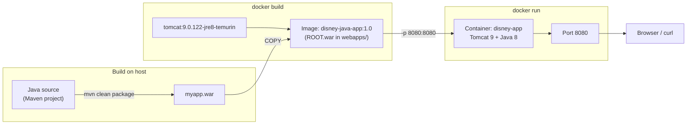
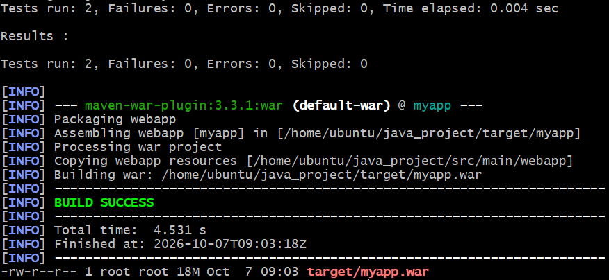
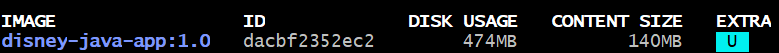
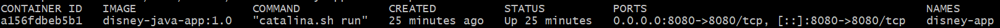
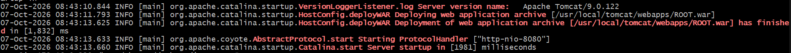
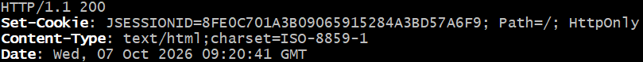
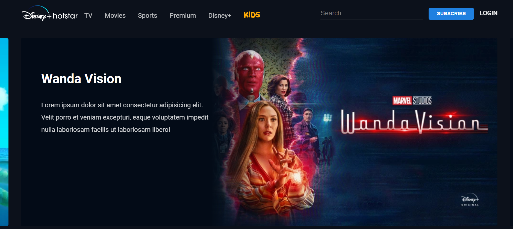

# 🐳 Dockerized Java Web Application

> A traditional Java WAR application — built with Maven, packaged into a Docker image, and deployed on Apache Tomcat 9 (Java 8), then verified from the build log all the way to the browser.

     

**At a glance**
- 🐳 Packages a Maven-built WAR into a Docker image (`disney-java-app:1.0`) on the official `tomcat:9.0.122-jre8-temurin` base image
- 🚪 Deploys the app as `ROOT.war`, so it is served at the context root (`/`) on port `8080`
- ✅ Verified layer by layer: Maven tests → image → container → Tomcat logs → HTTP 200 → browser
- 📸 Six screenshots document each verification step
- 🔗 Forms the Docker stage of the broader DevOps portfolio lifecycle — see the [Portfolio Roadmap](#roadmap)

---

## 📚 Table of Contents

- [Project Overview](#overview)
- [Objectives](#objectives)
- [Technology Stack](#stack)
- [Project Structure](#structure)
- [Dockerfile](#dockerfile)
- [Prerequisites](#prerequisites)
- [Build & Run](#build-run)
- [Verification](#verification)
- [Troubleshooting Quick Reference](#troubleshooting)
- [Screenshots](#screenshots)
- [Key DevOps Concepts Demonstrated](#concepts)
- [Interview Preparation](#interview-prep)
- [Known Limitations](#limitations)
- [Future Improvements](#improvements)
- [Portfolio Roadmap](#roadmap)
- [Project Status](#status)
- [Author](#author)
- [License](#license)

---

<a id="overview"></a>
## 📌 Project Overview

This project forms the **Docker stage** of the broader DevOps portfolio lifecycle. It takes a Java web application that Maven has already packaged as a WAR, wraps it in a Docker image based on Apache Tomcat 9 with Java 8, and runs it as a container.

The focus is the **delivery path**, not the application's features: proving that the app builds, deploys, starts, and answers HTTP requests inside a container the same way it would on any Docker host.

The sample application is a Disney+ Hotstar–style streaming homepage, used as a realistic WAR to deploy.

> [!NOTE]
> The sample app imitates the look of Disney+ Hotstar for learning and portfolio purposes only. It is not affiliated with or endorsed by Disney or Hotstar; all names, logos, and artwork shown in the screenshots belong to their respective owners.

### Architecture



<a id="objectives"></a>
## 🎯 Objectives

- Containerize a WAR-based Java web application with a simple and readable Dockerfile
- Run it on Apache Tomcat 9 with a Java 8 runtime inside a container
- Prove deployment success with evidence at every layer: build, image, container, Tomcat logs, HTTP, and browser
- Produce a version-tagged image (`disney-java-app:1.0`) that can be rebuilt and re-run on any Docker host

<a id="stack"></a>
## 🛠️ Technology Stack

| Technology | Purpose |
| --- | --- |
| Java 8 (Eclipse Temurin JRE in the image) | Application runtime |
| Apache Maven (`maven-war-plugin` 3.3.1) | Run tests and package the WAR |
| Docker | Build the image and run the container |
| Apache Tomcat 9.0.122 | Servlet container that hosts the WAR |
| `tomcat:9.0.122-jre8-temurin` | Official base image (Tomcat 9 + Java 8) |
| Linux / Ubuntu | Build and deployment environment |
| Git / GitHub | Source control and portfolio |

<a id="structure"></a>
## 📁 Project Structure

```text
02-docker-application/
├── Dockerfile                        # Image definition: Tomcat 9 + Java 8 + the WAR
├── README.md                         # Project documentation
└── screenshots/                      # Verification evidence
    ├── 01-maven-build-success.png
    ├── 02-docker-image.png
    ├── 03-running-container.png
    ├── 04-tomcat-deployment.png
    ├── 05-http-200.png
    └── 06-application-running.png
```

`myapp.war` is a build artifact (about 18 MB), so it is deliberately **not** committed. Maven generates it, and it is copied next to the `Dockerfile` at build time. The Java/Maven source itself is not part of this repository — this project covers the Docker stage only.

<a id="dockerfile"></a>
## 🐳 Dockerfile

```dockerfile
FROM tomcat:9.0.122-jre8-temurin

COPY myapp.war /usr/local/tomcat/webapps/ROOT.war

EXPOSE 8080
```

| Instruction | What it does |
| --- | --- |
| `FROM tomcat:9.0.122-jre8-temurin` | Starts from the official Tomcat image — Tomcat 9.0.122 on a Java 8 JRE (Eclipse Temurin). The pinned tag keeps the Tomcat and Java version explicit and avoids unexpected upgrades from a floating tag such as `latest`. |
| `COPY myapp.war /usr/local/tomcat/webapps/ROOT.war` | Copies the Maven-built WAR into Tomcat's `webapps/` directory as `ROOT.war`. Tomcat auto-deploys it at startup. |
| `EXPOSE 8080` | Documents that the container listens on port 8080 (Tomcat's default). It does not publish the port — that happens at run time with `-p 8080:8080`. |

No `CMD` is needed: the base image already starts Tomcat with `catalina.sh run`, which keeps Tomcat in the foreground so the container stays alive and its logs are available through `docker logs`.

### Design decisions

| Decision | Reasoning |
| --- | --- |
| Build the WAR outside Docker | Keeps the image focused on runtime — Maven and a JDK are not shipped in it. Trade-off: a manual copy step (a multi-stage build is listed under [Future Improvements](#improvements)). |
| Tomcat 9 + Java 8 | Tomcat 9 uses the `javax.*` servlet namespace that traditional WAR applications expect; Tomcat 10+ moved to `jakarta.*` and would need code changes. |
| Name the file `ROOT.war` | Tomcat derives the context path from the WAR name, and `ROOT.war` maps to `/`. The site opens at `http://localhost:8080/` instead of `/myapp/`. |
| Pin the base image tag | A fixed tag such as `9.0.122-jre8-temurin` avoids surprise upgrades from floating tags like `latest`. Trade-off: this is a tag pin, not a digest pin, so the image behind the tag can still be rebuilt upstream; pinning by digest (`@sha256:…`) would be stricter. |
| Tag the image `1.0` | Makes it clear which build is running and gives later stages a version to reference or roll back to. |

<a id="prerequisites"></a>
## ✅ Prerequisites

- A Linux host (built and tested on Ubuntu) with **Docker** installed and running — check with `docker --version`
- **JDK 8** (or a newer JDK configured to compile for Java 8) and **Maven**, needed only to build the WAR — check with `java -version` and `mvn -version`
- The **Maven project** that produces `myapp.war` (not included in this repository)
- Port **8080** free on the host

<a id="build-run"></a>
## 🚀 Build & Run

> [!NOTE]
> Paths and names below match my Ubuntu server — `~/java_project` for the Maven project and `~/docker-disney-app` for the Docker build context. Adjust them to your environment.

### Step 1 — Build the WAR with Maven

```bash
cd ~/java_project              # the Maven project (contains pom.xml)
mvn clean package
ls -lh target/myapp.war
```

Expected: `BUILD SUCCESS`, `Tests run: 2, Failures: 0, Errors: 0, Skipped: 0`, and `target/myapp.war` (about 18 MB).

### Step 2 — Prepare the Docker build context

```bash
cp target/myapp.war ~/docker-disney-app/
cd ~/docker-disney-app         # the folder that contains the Dockerfile
ls                             # should list Dockerfile and myapp.war
```

The build context must contain both the `Dockerfile` and `myapp.war` — `COPY` can only see files inside the context.

### Step 3 — Build the image

```bash
docker build -t disney-java-app:1.0 .
docker images disney-java-app
```

Expected: `disney-java-app` tagged `1.0` (about 474 MB on disk, 140 MB content size).

### Step 4 — Run the container

```bash
docker run -d --name disney-app -p 8080:8080 disney-java-app:1.0
docker ps
```

| Flag | Meaning |
| --- | --- |
| `-d` | Run in the background (detached) |
| `--name disney-app` | Give the container a fixed, readable name |
| `-p 8080:8080` | Publish container port 8080 on host port 8080 (`host:container`) |

Expected: `disney-app` shows `Up`, runs `catalina.sh run`, and maps `0.0.0.0:8080->8080/tcp`.

### Step 5 — Stop and clean up

```bash
docker stop disney-app
docker rm disney-app
docker rmi disney-java-app:1.0     # optional: remove the image as well
```

<a id="verification"></a>
## 🔍 Verification

Each layer is checked independently, so a failure can be traced to the layer that caused it.

| # | Layer | Command | What passing looks like | Result |
| --- | --- | --- | --- | --- |
| 1 | Maven build and tests | `mvn clean package` | `BUILD SUCCESS`, 2 tests run, 0 failures | ✅ |
| 2 | WAR artifact | `ls -lh target/myapp.war` | `myapp.war` (about 18 MB) | ✅ |
| 3 | Docker image | `docker images disney-java-app` | `disney-java-app:1.0` is listed | ✅ |
| 4 | Container state | `docker ps` | `disney-app` is `Up`, `0.0.0.0:8080->8080/tcp` | ✅ |
| 5 | Tomcat deployment | `docker logs disney-app` | `ROOT.war` deployed, HTTP connector started | ✅ |
| 6 | HTTP health | `curl -I http://localhost:8080` | `HTTP/1.1 200` | ✅ |
| 7 | Browser | open `http://localhost:8080` | Application homepage renders | ✅ |

If Docker runs on a remote server, browse to the server's IP address instead of `localhost` and make sure port 8080 is allowed through its firewall or security group.

### Tomcat deployment log

Key lines from `docker logs disney-app` (timestamps and logger names trimmed):

```text
Server version name:   Apache Tomcat/9.0.122
Deploying web application archive [/usr/local/tomcat/webapps/ROOT.war]
Deployment of web application archive [/usr/local/tomcat/webapps/ROOT.war] has finished in [1,832] ms
Starting ProtocolHandler ["http-nio-8080"]
Server startup in [1981] milliseconds
```

Tomcat deployed `ROOT.war`, started the HTTP connector on port 8080, and finished starting up in about two seconds.

### HTTP check

```text
$ curl -I http://localhost:8080
HTTP/1.1 200
Content-Type: text/html;charset=ISO-8859-1
```

`HTTP/1.1 200` (headers trimmed) confirms the application is answering over HTTP. A scriptable variant that prints only the status code:

```bash
curl -s -o /dev/null -w "%{http_code}\n" http://localhost:8080
```

<a id="troubleshooting"></a>
## 🩺 Troubleshooting Quick Reference

Common failure modes for this kind of setup and how to diagnose them:

| Symptom | Likely cause | What to do |
| --- | --- | --- |
| `docker run` fails with `port is already allocated` | Another process or container is already using port 8080 | Find it with `sudo ss -ltnp 'sport = :8080'` (or `docker ps`) and stop it, or publish a different host port, e.g. `-p 9090:8080` |
| `container name "/disney-app" is already in use` | A container with that name already exists, running or stopped | `docker rm -f disney-app`, then run again |
| `docker build` fails at the `COPY` step (`myapp.war` not found) | The WAR is not in the build context | Run the build from the folder that contains both `Dockerfile` and `myapp.war` |
| Browser shows HTTP 404 at `/` | The WAR was not deployed as `ROOT.war`, or deployment failed | Check `docker logs disney-app` for deployment errors and confirm the `COPY` target ends in `webapps/ROOT.war` |
| Logs show `UnsupportedClassVersionError` | The WAR was compiled with a newer JDK than the Java 8 runtime | Compile for Java 8, or switch to a base image with a newer JRE tag |
| Works on the server but not from another machine | Port 8080 is blocked by a firewall or cloud security group | Allow inbound TCP 8080 and browse to the server's IP, not `localhost` |
| Rebuilt the WAR but still see the old app | The running container is still based on the old image | Rebuild the image, then `docker rm -f disney-app` and `docker run` again |

<a id="screenshots"></a>
## 📸 Screenshots

Terminal and browser captures for each step are stored in `screenshots/` and shown below.

### 1. Maven build success
Two passing tests, `BUILD SUCCESS`, and the generated `myapp.war`.



### 2. Docker image
The `disney-java-app:1.0` image after `docker build`.



### 3. Running container
`disney-app` is up, running `catalina.sh run`, with port 8080 mapped.



### 4. Tomcat deployment
Tomcat 9.0.122 deploys `ROOT.war`, starts the HTTP connector, and completes startup.



### 5. HTTP 200 response
The application responds successfully over HTTP.



### 6. Application running
The deployed Java web application rendered in the browser.



<a id="concepts"></a>
## 💡 Key DevOps Concepts Demonstrated

**Build & packaging**
- Java application packaging with Maven and the WAR format
- Running unit tests as part of the build (`mvn clean package`)
- Keeping build artifacts out of source control

**Containerization**
- Writing a simple, readable Dockerfile and building a tagged image
- Choosing and tag-pinning a base image
- Container lifecycle management: `build`, `run`, `ps`, `logs`, `stop`, `rm`
- Port publishing (`-p host:container`) versus `EXPOSE`

**Deployment & verification**
- WAR deployment on Apache Tomcat, including context root handling with `ROOT.war`
- Container log analysis as deployment evidence
- HTTP health checks with `curl`
- Layer-by-layer, evidence-based verification
- Diagnosing common container and Tomcat failures

<a id="interview-prep"></a>
## 💼 Interview Preparation

**What's the difference between a Docker image and a container?**
An image is a read-only, layered template built from the Dockerfile (`disney-java-app:1.0`). A container is a running instance of that image (`disney-app`) with its own writable layer and process. One image can start many containers.

**Walk me through your Dockerfile.**
`FROM` starts from the official Tomcat 9 / Java 8 image, `COPY` places the WAR in Tomcat's `webapps/` directory as `ROOT.war`, and `EXPOSE` documents port 8080. The base image's default command, `catalina.sh run`, starts Tomcat, which auto-deploys the WAR at startup.

**Why name the file `ROOT.war`?**
Tomcat uses the WAR file name as the context path. `ROOT.war` is the special name that maps to `/`, so the app opens at `http://host:8080/` rather than `http://host:8080/myapp/`.

**What's the difference between `EXPOSE 8080` and `-p 8080:8080`?**
`EXPOSE` is metadata — it records which port the container listens on but opens nothing. `-p host:container` actually publishes the port so traffic arriving at the host reaches the container.

**Why did you build the WAR outside Docker, and what would you change?**
It keeps the Dockerfile simple and the image focused on runtime (no Maven or JDK inside), but it needs Maven and a JDK on the host plus a manual copy step. A multi-stage build would run Maven in a builder stage and copy only the WAR into the Tomcat stage, so `docker build` works from source on any machine with Docker.

**Why pin the base image instead of using `latest`?**
Floating tags change over time, so the same Dockerfile could produce a different Tomcat or Java version next month. A pinned tag keeps the version explicit and turns upgrades into a deliberate, reviewable change. It is a tag pin rather than a digest pin, so strictly identical builds would also need the image digest pinned.

**Why Tomcat 9 and not Tomcat 10 or 11?**
Tomcat 9 implements the Servlet 4.0 API under the `javax.*` namespace that traditional WAR applications use. Tomcat 10 and later moved to `jakarta.*`, so an older application needs code or dependency changes before it can run there.

**How do you verify the container is really working, not just running?**
Check the layers in order: `docker ps` (is it up, is the port mapped?), `docker logs` (did Tomcat deploy the WAR and start the connector?), `curl -I` (does it return HTTP 200?), then a browser. A container can be `Up` while the application inside failed to deploy, so the logs and the HTTP check matter.

**How would you make this production-ready?**
Use a multi-stage build, run Tomcat as a non-root user, add a `HEALTHCHECK`, add a `.dockerignore`, scan the image for vulnerabilities (for example with Trivy), push it to a registry, and put TLS in front of it via a reverse proxy or load balancer.

<a id="limitations"></a>
## ⚠️ Known Limitations

- The WAR is built on the host and copied in manually, so `docker build` alone cannot produce the image from source (no multi-stage build yet).
- Tomcat runs as `root` inside the container, which is the default for the official image; there is no dedicated non-root user.
- There is no `HEALTHCHECK` instruction — health is verified manually with `docker logs` and `curl`.
- The image is built and run on a single host; pushing it to a registry is a future step.
- Traffic is plain HTTP on port 8080, with no TLS or reverse proxy in front.
- Java 8 is an older runtime; moving to a newer LTS release would require compatibility testing.

<a id="improvements"></a>
## 🚧 Future Improvements

- Convert to a **multi-stage Dockerfile** with a Maven builder stage, so the WAR is built inside Docker
- Run Tomcat as a **non-root user**
- Add a **`HEALTHCHECK`** so Docker can report container health
- Add a **`.dockerignore`**, and a `.gitignore` entry for `*.war`
- Scan the image for vulnerabilities (Trivy or Docker Scout)
- Push the image to a registry (Docker Hub or Amazon ECR) for use in later stages
- Automate the build → image flow in a CI/CD pipeline (planned as Project 03 in the [Portfolio Roadmap](#roadmap))

<a id="roadmap"></a>
## 🗺️ Portfolio Roadmap

**Project 01 is an independent Linux and shell-scripting foundation** and is not part of the Java application pipeline. Projects 02–06 follow one Java WAR application through its DevOps lifecycle: Docker (this project), then the planned CI/CD, cloud infrastructure, Kubernetes, and monitoring stages.

| # | Project | Focus | Status |
| --- | --- | --- | --- |
| 01 | [Linux & Shell Scripting](../01-linux-shell-scripting/README.md) *(independent foundation)* | Server monitoring, backups, and Cron automation | ✅ Completed |
| 02 | Docker Application *(this project)* | Containerize the Java WAR on Tomcat | ✅ Completed |
| 03 | [Jenkins CI/CD Pipeline](../03-jenkins-cicd-pipeline/) | Automate the build → image → deploy flow | 🔜 Planned |
| 04 | [Terraform + AWS](../04-terraform-aws/) | Provision AWS infrastructure as code | 🔜 Planned |
| 05 | [Kubernetes Deployment](../05-kubernetes-deployment/) | Deploy the containerized app on Kubernetes | 🔜 Planned |
| 06 | [Monitoring with CloudWatch](../06-monitoring-cloudwatch/) | Metrics, logs, and alarms for the deployment | 🔜 Planned |

<a id="status"></a>
## 🏁 Project Status

**Status: Completed.** The Docker stage is built and verified end to end. The items under [Future Improvements](#improvements) are possible next steps, not blockers.

<a id="author"></a>
## 🧑‍💻 Author

**Dileep** — [@dileepkumar-bit](https://github.com/dileepkumar-bit) on GitHub

Part of the [`devops-portfolio`](https://github.com/dileepkumar-bit/devops-portfolio) series of hands-on infrastructure projects.

<a id="license"></a>
## 📄 License

No license file is currently included in this repository. The project is shared for portfolio and learning purposes.
