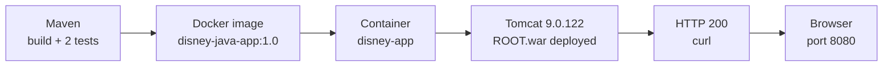

# 🐳 Dockerized Java Web Application

A Maven-built Java WAR, packaged into a Docker image and run on Apache Tomcat 9, verified at every layer from the build log to the browser.

     

- 🎯 **Purpose:** Prove that a traditional Java WAR builds, deploys, starts, and answers HTTP inside a container. The focus is the delivery path, not the app's features. This is the Docker stage (Project 02) of my [DevOps portfolio](https://github.com/dileepkumar-bit/devops-portfolio).
- 🛠️ **My work:** Dockerfile, Docker image, container deployment, Tomcat deployment, and verification (logs, `curl`, browser). The Java application itself is not mine; see [What I implemented](#what-i-implemented).
- 🧰 **Stack:** Java 8 · Maven (`maven-war-plugin` 3.3.1) · Docker · Apache Tomcat 9.0.122 · Ubuntu Linux · Git/GitHub
- ✅ **Result:** Image `disney-java-app:1.0` runs as container `disney-app`. Tomcat deploys `ROOT.war` in 1.8 s and the app answers **HTTP 200** on port 8080. [Jump to the evidence](#verification-evidence).



## What I implemented

- 🐳 **Dockerfile:** wrote the [Dockerfile](#dockerfile) with a pinned Tomcat 9 / Java 8 base image, deploying the WAR as `ROOT.war` so the app is served at `/`.
- 🔗 **Full delivery chain:** I ran every step myself. I built the WAR with Maven (its 2 included tests pass), built the image `disney-java-app:1.0`, and started the container `disney-app` on port 8080. Then I confirmed the Tomcat deployment, HTTP 200, and the page in a browser. Each step has [evidence below](#verification-evidence).
- 🧠 **Design choices:** Tomcat 9 for `javax.*` compatibility, a pinned base-image tag, a version-tagged image (`1.0`), and the WAR built outside Docker to keep the image runtime-only.
- 🧹 **Repo hygiene:** [`.gitignore`](.gitignore) keeps the 18 MB WAR out of Git; [`.dockerignore`](.dockerignore) limits the build context to the WAR.
- 🩺 **Troubleshooting notes:** port and name clashes, missing WAR, 404 at `/`, Java version mismatch, and firewall blocks. See [Troubleshooting](#troubleshooting).

⚠️ **Not my work:** the Java/Maven application inside `myapp.war` was not developed by me. It is a third-party sample application that I use only as a realistic WAR to deploy. I did not write or modify its code, and its original source is not recorded in this repository. Third-party names or artwork visible in the sample UI belong to their owners.

✅ **My contribution:** the Dockerfile, the Docker image, the container deployment, the Tomcat deployment, and the verification of each layer.

## Verification evidence

🔍 Each layer is checked on its own, so a failure points to the layer that caused it.

| # | Stage | Command | Passing result | Proof |
| --- | --- | --- | --- | --- |
| 1 | 🔨 Maven | `mvn clean package` | `BUILD SUCCESS`, 2 tests run, 0 failures, `target/myapp.war` (~18 MB) | ✅ [Screenshot 1](#1-maven-build) |
| 2 | 🐳 Docker image | `docker build -t disney-java-app:1.0 .` | Image listed by `docker images` (~474 MB on disk, 140 MB content) | ✅ [Screenshot 2](#2-docker-image) |
| 3 | 📦 Container | `docker run -d --name disney-app -p 8080:8080 disney-java-app:1.0` | `docker ps` shows `Up` and `0.0.0.0:8080->8080/tcp` | ✅ [Screenshot 3](#3-running-container) |
| 4 | 🐱 Tomcat | `docker logs disney-app` | `ROOT.war` deployed in 1,832 ms, HTTP connector started | ✅ [Screenshot 4](#4-tomcat-deployment) |
| 5 | 🌐 HTTP | `curl -I http://localhost:8080` | `HTTP/1.1 200` | ✅ [Screenshot 5](#5-http-200) |
| 6 | 🖥️ Browser | open `http://localhost:8080/` | Application page renders | ✅ [Screenshot 6](#6-application-in-the-browser) |

### 1. Maven build
Two passing tests, `BUILD SUCCESS`, and the generated `myapp.war`.


### 2. Docker image
`disney-java-app:1.0` listed after `docker build`.


### 3. Running container
`disney-app` is `Up`, running `catalina.sh run`, with port 8080 mapped.


### 4. Tomcat deployment
Key lines from `docker logs disney-app` (timestamps and logger names trimmed):

```text
Server version name:   Apache Tomcat/9.0.122
Deploying web application archive [/usr/local/tomcat/webapps/ROOT.war]
Deployment of web application archive [/usr/local/tomcat/webapps/ROOT.war] has finished in [1,832] ms
Starting ProtocolHandler ["http-nio-8080"]
Server startup in [1981] milliseconds
```


### 5. HTTP 200
`curl -I` returns `HTTP/1.1 200`, so the application answers over HTTP. Scriptable variant that prints only the status code: `curl -s -o /dev/null -w "%{http_code}\n" http://localhost:8080`


### 6. Application in the browser
The third-party sample application (not developed by me) rendered in a browser at `localhost:8080`, served by the container.


## Dockerfile

```dockerfile
FROM tomcat:9.0.122-jre8-temurin
COPY myapp.war /usr/local/tomcat/webapps/ROOT.war
EXPOSE 8080
```

| 🧩 Choice | 💡 Why |
| --- | --- |
| `tomcat:9.0.122-jre8-temurin` | Official image with Tomcat 9 and a Java 8 JRE (Eclipse Temurin). Tomcat 9 keeps the `javax.*` servlet namespace that traditional WARs use; Tomcat 10+ moved to `jakarta.*`. The pinned tag avoids surprise upgrades from `latest`. It is a tag pin, not a digest pin, so strictly identical builds would also need `@sha256:…`. |
| `ROOT.war` | Tomcat takes the context path from the WAR name, and `ROOT` maps to `/`. The app opens at `http://localhost:8080/` instead of `/myapp/`. |
| `EXPOSE 8080` | Documentation only. The port is published at run time with `-p 8080:8080` (`host:container`). |
| No `CMD` | The base image already runs `catalina.sh run`, which keeps Tomcat in the foreground so the container stays up and `docker logs` works. |
| WAR built outside Docker | Keeps the image runtime-only (no Maven or JDK inside). Trade-off: a manual copy step, addressed under [next steps](#limitations-and-next-steps). |
| Image tag `1.0` | Makes the running build explicit and gives later stages a version to reference or roll back to. |

## Run it yourself

The sample application's source and WAR are not included in this repository (see [Not my work](#what-i-implemented)). Steps 3–5 should also work with another `javax`-based WAR compiled for Java 8, named `myapp.war` and placed next to the Dockerfile. Needs Docker, JDK 8 and Maven (only to build the WAR), and port 8080 free. Paths match my Ubuntu server (`~/java_project` for the Maven project, `~/docker-disney-app` for the Docker build folder); adjust them to your environment.

```bash
# 1. Build the WAR (expect BUILD SUCCESS, 2 tests, target/myapp.war)
cd ~/java_project && mvn clean package

# 2. Copy it next to the Dockerfile (build context: Dockerfile, .dockerignore, myapp.war)
cp target/myapp.war ~/docker-disney-app/ && cd ~/docker-disney-app

# 3. Build and tag the image
docker build -t disney-java-app:1.0 .

# 4. Run the container
docker run -d --name disney-app -p 8080:8080 disney-java-app:1.0

# 5. Verify
docker ps
docker logs disney-app
curl -s -o /dev/null -w "%{http_code}\n" http://localhost:8080    # 200

# Clean up
docker stop disney-app && docker rm disney-app
docker rmi disney-java-app:1.0                                    # optional
```

```text
02-docker-application/
├── Dockerfile
├── .dockerignore       # build context = myapp.war only
├── .gitignore          # keeps *.war out of Git
├── README.md
└── screenshots/        # 01-06 verification evidence
```

`myapp.war` is generated by Maven (about 18 MB) and copied in at build time, so it is deliberately not committed.

## Troubleshooting

| 🚨 Symptom | 🔧 Cause and fix |
| --- | --- |
| `port is already allocated` | Another process uses 8080. Find it with `sudo ss -ltnp 'sport = :8080'` and stop it, or publish another port, e.g. `-p 9090:8080`. |
| `container name "/disney-app" is already in use` | An old container exists. Run `docker rm -f disney-app`, then run again. |
| `COPY` fails, `myapp.war` not found | The WAR is not in the build context. Build from the folder that holds `Dockerfile` and `myapp.war`, and do not exclude the WAR in `.dockerignore`. |
| HTTP 404 at `/` | The WAR was not deployed as `ROOT.war`, or deployment failed. Check `docker logs disney-app` and the `COPY` target. |
| `UnsupportedClassVersionError` in logs | The WAR was compiled with a newer JDK than the Java 8 runtime. Compile for Java 8, or use a newer JRE image tag. |
| Works on the server, not from another machine | A firewall or cloud security group blocks 8080. Allow inbound TCP 8080 and browse to the server's IP instead of `localhost`. |
| Rebuilt the WAR but still see the old app | The container still uses the old image. Rebuild the image, `docker rm -f disney-app`, and run again. |

## Limitations and next steps

| ⚠️ Limitation today | 🚀 Planned improvement |
| --- | --- |
| WAR is built on the host and copied in by hand | Multi-stage Dockerfile with a Maven builder stage, so `docker build` works from source |
| Tomcat runs as `root` (default of the official image) | Run as a non-root user |
| No `HEALTHCHECK`; health is checked manually | Add a `HEALTHCHECK` |
| Single host, plain HTTP, image not pushed anywhere | Scan with Trivy or Docker Scout, push to Docker Hub or ECR, add TLS through a reverse proxy |
| Java 8 is an older runtime | Move to a newer LTS release after compatibility testing |
| Build → image flow is manual | Automate it in CI/CD (Project 03, Jenkins) |

## Portfolio and author

📌 Project 02 of the [`devops-portfolio`](https://github.com/dileepkumar-bit/devops-portfolio). [Project 01 (Linux and shell scripting)](../01-linux-shell-scripting/README.md) is an independent foundation; Projects 02–06 follow one Java WAR through its lifecycle: **Docker (this project)** → Jenkins CI/CD → Terraform + AWS → Kubernetes → CloudWatch monitoring (03–06 planned).

👤 **Dileep** · [@dileepkumar-bit](https://github.com/dileepkumar-bit) · No license file is included; shared for portfolio and learning purposes.
