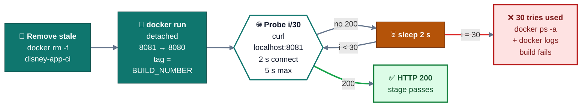

# 🚀 Jenkins CI/CD Pipeline for a Java Web Application

**Source code → tested WAR → Docker image → running container → verified HTTP 200 → clean exit**

One declarative Jenkins pipeline with automated quality gates, and screenshot evidence from build #4.

[🎯 Overview](#-project-at-a-glance) · [⭐ Contribution](#-my-contribution) · [📐 Architecture](#-architecture) · [⭐ Evidence](#-verification-evidence) · [🧠 Decisions](#-design-decisions) · [📄 Jenkinsfile](Jenkinsfile) · [🚧 Next steps](#-limitations-and-next-steps)

## 🎯 Project at a glance

- 🎯 **Purpose:** automate the path from source code to a *verified* running container, so a build only goes green when the application really answers over HTTP. This is Project 03 of my [DevOps portfolio](https://github.com/dileepkumar-bit/devops-portfolio). It automates the manual build, image, and run steps from [Project 02](../02-docker-application/README.md).
- 🛠️ **My work:** the declarative [Jenkinsfile](Jenkinsfile) for the job `disney-java-ci`: stages, verification gates, retry logic, and cleanup. The Java application is not mine; see [My contribution](#-my-contribution).
- 🧰 **Stack:** Jenkins (pipeline) · Maven (build and test) · Java 8 · Docker · Tomcat 9 · Bash (verify, retry, cleanup) · Git/GitHub
- 🧠 **Demonstrates:** pipeline as code, fail-fast verification, readiness polling, guaranteed cleanup, and build-to-image traceability.
- ✅ **Result:** build **#4** passed every stage in **35 s**: 2 tests and 0 failures, image `disney-java-app:4`, **HTTP 200** from the container, and the temporary container removed. [Jump to the evidence](#-verification-evidence).

> [!TIP]
> **Short on time? A two-minute review path:**
> ① the [architecture](#-architecture) below (30 s) → ② the `Run & Verify Container` stage and the `post { always }` block in the [Jenkinsfile](Jenkinsfile) (1 min) → ③ evidence screenshot 5, where the retry loop succeeds on the second probe (30 s).

## ⭐ My contribution

> [!NOTE]
> **Credit and scope.** The Java web application is **not my work**. It is a third-party sample app that the pipeline checks out and builds. The copy used here lives in my GitHub account as [`java_project_disneyhotstart-main`](https://github.com/dileepkumar-bit/java_project_disneyhotstart-main). I did not write its application code; my only edits to it are small display-text changes (movie titles in `index.jsp`). The CI/CD pipeline around it is my work.

✅ **My work: the CI/CD pipeline in this folder**

- **Pipeline as code:** wrote the declarative [`Jenkinsfile`](Jenkinsfile) that drives the Jenkins job `disney-java-ci`.
- **Build automation:** automated build, test, and packaging with Maven, plus a gate that fails the build if the WAR is missing.
- **Containerization:** built a build-numbered Docker image from my [Project 02 Dockerfile](../02-docker-application/Dockerfile).
- **Runtime verification:** ran the image as a container and automated the HTTP 200 check, with retries.
- **Cleanup and reporting:** archived the WAR and test results in Jenkins, and always removed the temporary container.

## 📐 Architecture

```mermaid
%%{init: {"flowchart": {"curve": "linear", "nodeSpacing": 35, "rankSpacing": 50, "padding": 18, "htmlLabels": false}, "theme": "base", "themeVariables": {"fontFamily": "Arial, sans-serif", "fontSize": "14px"}}}%%
flowchart TB

    JK["JENKINS<br/>Pipeline: disney-java-ci"]

    subgraph SRC["SOURCE - GITHUB"]
        direction LR
        S1["1. Checkout CI Repository<br/>Jenkinsfile and Dockerfile"]
        S2["2. Checkout Application<br/>Java source in app-source/"]
        S1 --> S2
    end

    subgraph BLD["BUILD AND TEST - MAVEN"]
        direction LR
        B1["3. Build and Test<br/>mvn clean package"]
        B2{"4. WAR Exists?<br/>myapp.war"}
        B1 --> B2
    end

    subgraph PKG["PACKAGE - DOCKER"]
        direction LR
        P1["5. Prepare Build Context<br/>WAR and Dockerfile"]
        P2["6. Build Docker Image<br/>Tag: BUILD_NUMBER"]
        P3{"7. Verify Image<br/>docker image inspect"}
        P1 --> P2 --> P3
    end

    subgraph RUN["RUN AND VERIFY"]
        direction LR
        R1["8. Run Container<br/>Host 8081 to Container 8080<br/>Remove stale container first"]
        R2{"HTTP Status<br/>200 OK?"}
        R3["SUCCESS<br/>Application Verified"]
        R4["FAILURE<br/>Check docker ps -a<br/>and docker logs"]
        R1 --> R2
        R2 -->|Yes| R3
        R2 -->|No| R4
    end

    subgraph POST["POST ACTIONS - ALWAYS RUN"]
        direction LR
        Q1["Archive WAR<br/>Fingerprint Artifact"]
        Q2["Publish JUnit<br/>Test Results"]
        Q3["Cleanup<br/>Remove disney-app-ci"]
        Q1 --> Q2 --> Q3
    end

    JK --> S1
    S2 -->|Application Source| B1
    B2 -->|WAR File| P1
    P3 -->|Image Built| R1
    R3 -.->|Pipeline Completion| Q1
    R4 -.->|Pipeline Completion| Q1

    classDef jenkins fill:#1E293B,stroke:#94A3B8,stroke-width:2px,color:#FFFFFF
    classDef source fill:#475569,stroke:#334155,color:#FFFFFF
    classDef build fill:#2563EB,stroke:#1E40AF,color:#FFFFFF
    classDef package fill:#4F46E5,stroke:#3730A3,color:#FFFFFF
    classDef runtime fill:#0F766E,stroke:#115E59,color:#FFFFFF
    classDef post fill:#B45309,stroke:#78350F,color:#FFFFFF
    classDef decision fill:#FFFFFF,stroke:#64748B,stroke-width:2px,color:#111827
    classDef success fill:#DCFCE7,stroke:#15803D,stroke-width:2px,color:#14532D
    classDef failure fill:#FEE2E2,stroke:#B91C1C,stroke-width:2px,color:#7F1D1D

    class JK jenkins
    class S1,S2 source
    class B1 build
    class B2,P3,R2 decision
    class P1,P2 package
    class R1 runtime
    class R3 success
    class R4 failure
    class Q1,Q2,Q3 post

    style SRC fill:#64748B15,stroke:#64748B,stroke-width:1.5px
    style BLD fill:#2563EB15,stroke:#2563EB,stroke-width:1.5px
    style PKG fill:#4F46E515,stroke:#4F46E5,stroke-width:1.5px
    style RUN fill:#0F766E15,stroke:#0F766E,stroke-width:1.5px
    style POST fill:#B4530915,stroke:#B45309,stroke-width:1.5px

    linkStyle default stroke:#64748B,stroke-width:1.5px
```

**How to read it:** each colored band is a pipeline phase, and the numbers match the [stage table](#-pipeline-stages) below. The white hexagons are **automated quality gates**: Verify WAR (4), Verify image (7), and the HTTP 200 probe (8). If a check fails, the build stops there and the cause is visible in the Jenkins console. The dashed arrow leads to the post actions, which run whether the build passes or fails, and at whichever stage it stops.

## 🔄 Pipeline stages

| # | Stage | What it does |
| --- | --- | --- |
| 1 | 📥 Checkout CI Repository | Pulls the `Jenkinsfile` and `Dockerfile` from this portfolio repo. |
| 2 | ☕ Checkout Application | Clones the Java source into `app-source/`. |
| 3 | 🔨 Maven Build & Test | Runs `mvn clean package` to build, test, and package the WAR. |
| 4 | 🔎 Verify WAR | Fails the build if `myapp.war` was not produced. |
| 5 | 🗂️ Prepare Docker Context | Copies only the WAR and Docker files into a clean `docker-context/`. |
| 6 | 🐳 Docker Build | Builds the image `disney-java-app:<BUILD_NUMBER>`. |
| 7 | 🔎 Verify Docker Image | Confirms the image exists with `docker image inspect`. |
| 8 | 🚀 Run & Verify Container | Removes any stale container, starts a new one, and polls until it returns HTTP 200. |
| 9 | 🧹 Post Actions | Archives the WAR, publishes JUnit results, and removes the container. Runs whether the build passes or fails (`post { always }`). |

## 🔧 Key configuration

| Setting | Value |
| --- | --- |
| 🏷️ Jenkins job | `disney-java-ci` (declarative pipeline, `agent any`) |
| 🐳 Image | `disney-java-app:<BUILD_NUMBER>` |
| 📦 Container | `disney-app-ci` |
| 🔌 Port | `8081:8080` (host:container) |
| 🩺 Health check | `curl http://localhost:8081` must return `200`; every 2 s, up to 30 tries |
| 🧱 Base image | `tomcat:9.0.122-jre8-temurin` |
| 📍 Where it runs | One Jenkins agent: Maven, Docker, and the curl check all run there |

## ⭐ Verification evidence

All screenshots are from Jenkins build **#4**, in pipeline order.

### 1 · 🟢 Pipeline overview: every stage passed in 35 s

### 2 · 🔨 Maven build and test: 2 tests run, 0 failures, `BUILD SUCCESS`

### 3 · 📦 WAR verified: `myapp.war` (18 MB) generated

### 4 · 🐳 Docker image built and tagged `disney-java-app:4`

### 5 · 🌐 Container run on `8081:8080`: HTTP 200 returned after one retry

### 6 · 🧹 Post actions: WAR archived, tests recorded, container removed, `Finished: SUCCESS`

## ⭐ Result

Build **#4**, every stage green, 35 s in total:

| Checkpoint | Result | Evidence |
| --- | --- | --- |
| Maven build | ✅ `BUILD SUCCESS` | Screenshot 2 |
| Unit tests | ✅ 2 run, 0 failures | Screenshot 2 |
| WAR packaged | ✅ `myapp.war` (18 MB) | Screenshot 3 |
| Docker image | ✅ built and tagged `disney-java-app:4` | Screenshot 4 |
| Container | ✅ started on `8081:8080` | Screenshot 5 |
| HTTP check | ✅ `200` returned after one retry | Screenshot 5 |
| Cleanup | ✅ WAR archived, tests recorded, container removed | Screenshot 6 |
| Overall | ✅ every stage passed in 35 s, `Finished: SUCCESS` | Screenshots 1 and 6 |

## 🧠 Design decisions

Why the pipeline is built the way it is. Every row can be checked in the [Jenkinsfile](Jenkinsfile).

| 💡 Decision | 🎯 Why it matters | 📍 Where |
| --- | --- | --- |
| Tag images with `BUILD_NUMBER` | Each image maps to exactly one Jenkins build, so it can be traced back, compared, or rolled back. There is no ambiguous `latest`. Build #4 produced `disney-java-app:4`. | Docker Build |
| Verify after every hand-off | WAR exists → image exists → app answers HTTP 200. A failure points at the layer that caused it instead of surfacing stages later. | Stages 4, 7, 8 |
| Clean, minimal Docker context | `docker-context/` is rebuilt from scratch and holds only the WAR and the Docker files, so builds are small, predictable, and free of stale files. | Prepare Docker Context |
| Bounded retry, not a fixed `sleep` | Tomcat needs a few seconds to deploy. Polling passes as soon as the app is ready, and the limits (30 tries; curl 2 s connect, 5 s total) stop a dead app from hanging the build. Only HTTP 200 passes: any other status (for example 404 while deploying) is logged and retried. | Run & Verify Container |
| Show the cause when it fails | If HTTP 200 never arrives, the stage prints `docker ps -a` and `docker logs`, then fails with exit code 1, so the reason is in the console without logging into the host. | Run & Verify Container |
| Always clean up | A stale container is removed before each run, and the temporary container is removed after each build, pass or fail. `allowEmptyArchive` and `allowEmptyResults` stop a missing file from failing the post actions, so the container is still removed. | Stage 8 and `post { always }` |
| One build at a time | The container name and host port are fixed, so overlapping builds would collide. `disableConcurrentBuilds()` queues them instead. | `options {}` |
| Keep the evidence in Jenkins | The WAR is archived and fingerprinted, and JUnit results are published, so a build can be inspected after its container is gone. | `post { always }` |

## 🩺 Troubleshooting and failure handling

- **Symptom:** the first `curl` right after `docker run` failed with `Connection reset by peer`.
- **Cause:** Tomcat needs a few seconds to deploy the WAR, so the app is not ready the moment the container starts.
- **Fix:** replaced the one-shot check with a retry loop: up to 30 attempts, 2 s apart, passing only on HTTP 200. In evidence screenshot 5 the first probe fails and the second succeeds.
- **If it never succeeds:** the stage prints `docker ps -a` and `docker logs`, then fails the build, so the cause is visible in the Jenkins console.

**Stage 8 in detail: the readiness check**

## 🧪 Run it yourself

**Requirements on the Jenkins agent:** Git, JDK 8, Maven (`mvn`), Docker (the Jenkins user must be able to run `docker`), `curl`, and host port **8081** free. Outbound access to GitHub, Maven Central, and Docker Hub is needed to fetch the sources, dependencies, and the Tomcat base image.

1. Create a **Pipeline** job named `disney-java-ci`.
2. Set **Definition** to *Pipeline script from SCM*, **SCM** to *Git*, the repository to `https://github.com/dileepkumar-bit/devops-portfolio.git`, and the branch to `*/main`.
3. Set **Script Path** to `03-jenkins-cicd-pipeline/Jenkinsfile`.
4. Click **Build Now**. All nine stages should turn green; build #4 took 35 s.

> [!NOTE]
> The pipeline reads `02-docker-application/Dockerfile`, so the job must check out the whole portfolio repository. `checkout scm` does that when the Script Path points into it.

## 🚧 Limitations and next steps

| ⚠️ Limitation today | 🚀 Possible improvement |
| --- | --- |
| The image exists only on the Jenkins host and is not pushed anywhere | Push `disney-java-app:<BUILD_NUMBER>` to Docker Hub or ECR, with credentials held in Jenkins |
| No security or code-quality scanning | Add image scanning (Trivy) and static analysis (SonarQube) with a quality gate before the image is promoted |
| JDK 8 and Maven come from the agent (`agent any`), not from the Jenkinsfile | Pin the toolchain with `tools {}` or build inside a Docker agent, so the Jenkinsfile defines the whole environment |
| Verification is a single HTTP 200 smoke test on `/` | Add a health endpoint and functional smoke tests, plus a Docker `HEALTHCHECK` |
| The container is temporary, so nothing stays deployed | Persistent deployment on Kubernetes: [Project 05](../05-kubernetes-deployment) |

## 📌 Portfolio and author

Project 03 of the [`devops-portfolio`](https://github.com/dileepkumar-bit/devops-portfolio). Projects 02–06 make up the Java application pipeline:

🐳 [Docker](../02-docker-application/README.md) → ⚙️ **Jenkins CI/CD (this project)** → ☁️ [Terraform + AWS](../04-terraform-aws) → ☸️ [Kubernetes](../05-kubernetes-deployment) → 📊 [CloudWatch monitoring](../06-monitoring-cloudwatch)

[Project 01 (Linux and shell scripting)](../01-linux-shell-scripting/README.md) is an independent foundation.

👤 **Dileep Kumar** · DevOps Engineer · GitHub: [@dileepkumar-bit](https://github.com/dileepkumar-bit) · Portfolio: [devops-portfolio](https://github.com/dileepkumar-bit/devops-portfolio)
