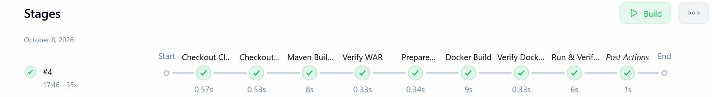
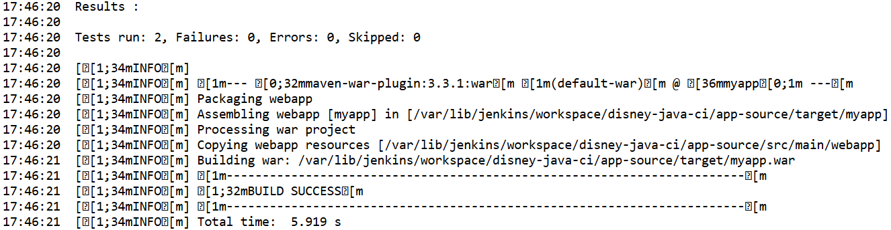
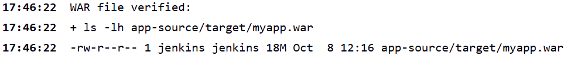
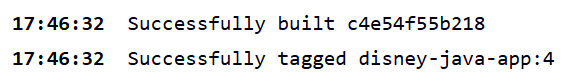
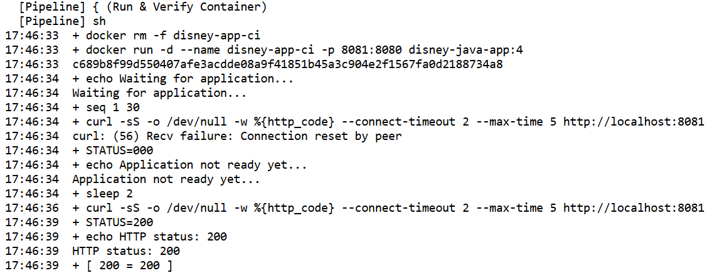
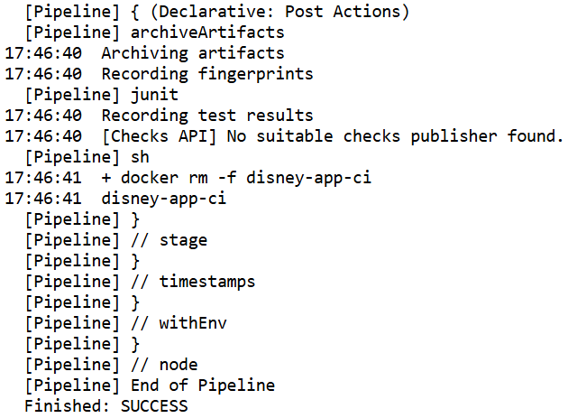

# Jenkins CI/CD Pipeline for Java Web Application

A Jenkins pipeline that builds and tests a Java web app with Maven, packages the WAR into a Docker image on Tomcat 9, runs it as a container, and verifies HTTP 200 before cleanup.

**Outcome:** Jenkins build #4 passed every stage in 35 s. This is Project 03 of my [DevOps portfolio](https://github.com/dileepkumar-bit/devops-portfolio).

## My Contribution ⭐

⚠️ **Not my work:** the Java web application. It is a third-party sample app ([source](https://github.com/dileepkumar-bit/java_project_disneyhotstart-main)) that the pipeline checks out and builds. I did not write or modify its code.

✅ **My work:** the CI/CD pipeline in this folder.

- Wrote the declarative [Jenkinsfile](Jenkinsfile) that drives the Jenkins job `disney-java-ci`.
- Automated the build, test, and package steps with Maven, plus a check that the WAR exists.
- Built a build-numbered Docker image from my [Project 02 Dockerfile](../02-docker-application/Dockerfile).
- Ran the image as a container and automated the HTTP 200 check, with retries.
- Archived the WAR and test results in Jenkins, and always removed the temporary container.

## Technology Stack

| Tool | Used for |
| --- | --- |
| Jenkins | Declarative pipeline orchestration |
| Git / GitHub | Source for the CI repo and the application |
| Maven | Build, test, and package (WAR) |
| Java 8 | Application build and runtime |
| Docker | Image build and container run |
| Tomcat 9 | Application server inside the container |
| Bash | Verify, retry, and cleanup steps |

## CI/CD Flow

```text
GitHub → Jenkins → Maven/Test → WAR → Docker Image → Container → HTTP 200 → Cleanup
```

## Pipeline Stages

| # | Stage | What it does |
| --- | --- | --- |
| 1 | Checkout CI Repository | Pulls the Jenkinsfile and Dockerfile from this portfolio repo. |
| 2 | Checkout Application | Clones the Java source into `app-source/`. |
| 3 | Maven Build & Test | Runs `mvn clean package` to build, test, and package the WAR. |
| 4 | Verify WAR | Fails the build if `myapp.war` was not produced. |
| 5 | Prepare Docker Context | Copies only the WAR and Docker files into a clean `docker-context/`. |
| 6 | Docker Build | Builds the image `disney-java-app:<BUILD_NUMBER>`. |
| 7 | Verify Docker Image | Confirms the image exists with `docker image inspect`. |
| 8 | Run & Verify Container | Starts the container and polls until it returns HTTP 200. |
| 9 | Post Actions | Archives the WAR, publishes JUnit results, and removes the container (always runs). |

## Key Configuration

| Setting | Value |
| --- | --- |
| Image | `disney-java-app:<BUILD_NUMBER>` |
| Container | `disney-app-ci` |
| Port | `8081:8080` (host:container) |
| Base image | `tomcat:9.0.122-jre8-temurin` |

> **Why `BUILD_NUMBER`?** Each image tag maps to exactly one Jenkins build, so any image can be traced back to the build that made it. Build #4 produced `disney-java-app:4`.

## Verification Evidence ⭐

All screenshots are from Jenkins build #4, in pipeline order.

**1. Pipeline overview: every stage passed in 35 s**



**2. Maven build & test: 2 tests run, 0 failures, `BUILD SUCCESS`**



**3. WAR verified: `myapp.war` (18 MB) generated**



**4. Docker image built and tagged `disney-java-app:4`**



**5. Container run on `8081:8080`: HTTP 200 returned after one retry**



**6. Post actions: WAR archived, tests recorded, container removed, `Finished: SUCCESS`**



## Result / Outcome ⭐

```text
✓ Maven build successful
✓ 2 tests passed
✓ WAR generated
✓ Docker image built
✓ Container started
✓ HTTP 200 verified
✓ Temporary container cleaned up
```

## Jenkinsfile

Full pipeline definition: [`Jenkinsfile`](Jenkinsfile). Start with the `Run & Verify Container` stage and the `post { always }` block.

## Troubleshooting / Engineering Detail

- **Problem:** Tomcat needs a few seconds to deploy the WAR, so the first `curl` right after `docker run` failed with `Connection reset by peer`.
- **Fix:** Replaced the one-shot check with a retry loop: up to 30 attempts, 2 s apart, passing only on HTTP 200 (screenshot 5: the second attempt succeeds).
- **If it never succeeds:** the stage prints `docker ps -a` and `docker logs`, then fails the build, so the cause is visible in the Jenkins console.

## Project Scope / Next Steps

- **Scope:** Project 03 focuses on Jenkins CI/CD and Docker validation: build, test, package, image, container, verify, cleanup. The container is temporary and is removed after verification.
- **Next:** Persistent deployment on Kubernetes is handled in [Project 05](../05-kubernetes-deployment).

## Author

**Dileep Kumar** · DevOps Engineer

- GitHub: [@dileepkumar-bit](https://github.com/dileepkumar-bit)
- Portfolio: [devops-portfolio](https://github.com/dileepkumar-bit/devops-portfolio)
